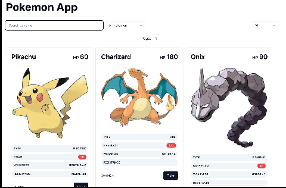

# CookUnity Engineer Coding Challenge

## Challenge instructions

[View PDF](Engineer_Coding_Challenge.pdf)

## Assumptions in general

- While designing the Database Schema decided to use PrismaJson fields type for: attack, weakness and resistance columns in Card model (Instead of having them in separate tables and creating the relations with them)
- For the sake of simplifying complexity, assumed every card has only one attack. Discarded the ones that depend on flipping 1 or 2 coins.
- Pokemons that do not have "Rarity" specified on the card have 'COMMON' as default value.

## Installation instructions

- [For Backend](https://github.com/JulianCazaux/cu-challenge/tree/main/backend)
- [For Frontend](https://github.com/JulianCazaux/cu-challenge/tree/main/frontend)

## Running Example

